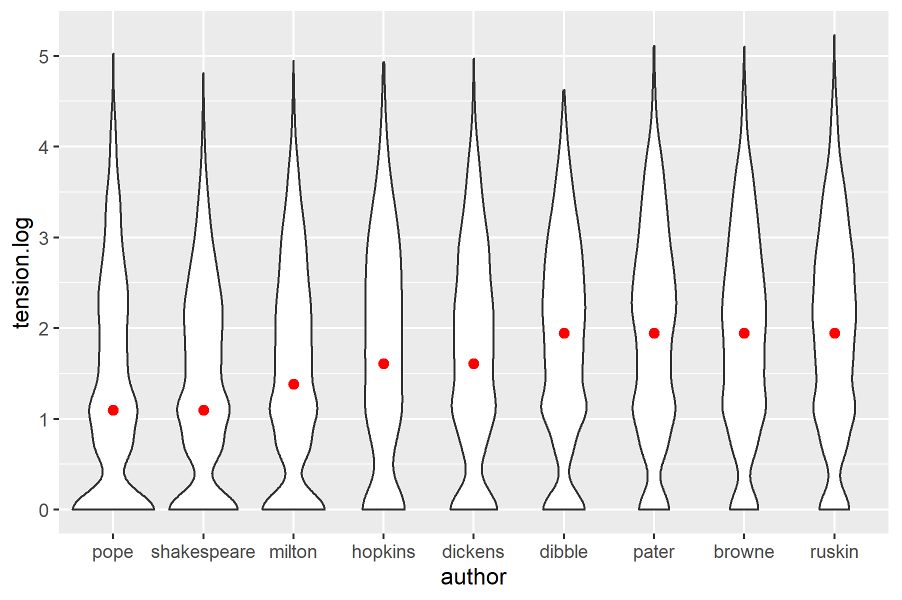
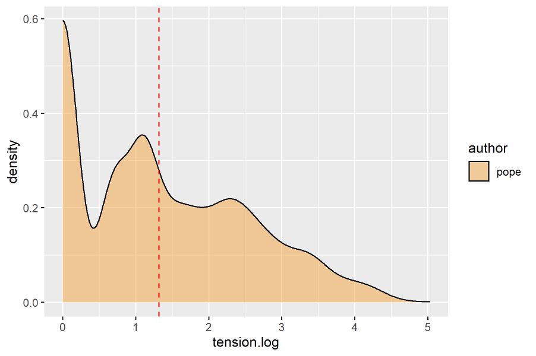
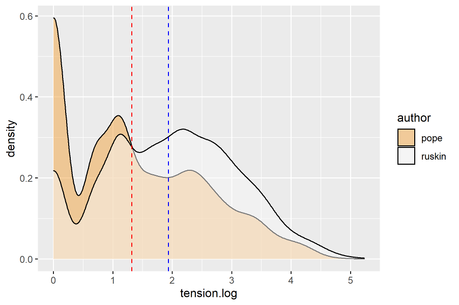
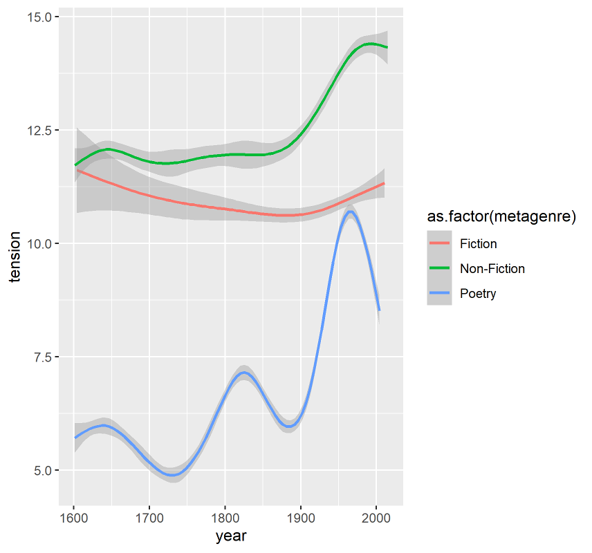

----
marp: true
theme: base-theme
paginate: true
_paginate: false
style: |
  section {
    font-size: 28px;
    font-family: "Garamond";
    vertical-align: text-top;
  }
  smallcaps { 
      font-variant: small-caps;
      font-weight: bold;
      #text-decoration:underline;
  }
  small {
      font-size: 80%;
  }
  cite {
      #font-size:90%;
      #font-style: normal;
  }
  viol {
      color:red;
  }
  img {
      text-align: center
  }
----

# Prose Rhythm and Antimetricality

Arto Anttila¹, Ryan Heuser², Paul Kiparsky¹

LSA 2022, “Literary Linguistic Forms”

 

<small>¹ Stanford University</small>
<small>² University of Cambridge</small>

---

# 1. Outline

(1)	Metrics is usually concerned with verse. Does prose have meter? Is meter even relevant? Or does prose have anti-meter? <cite>(Saintsbury 1912)</cite>

(2)	Proposal: Prose assumes the role of anti-verse in historical periods where metrical verse is the <smallcaps>Dominant</smallcaps> <cite>(Jakobson 1935)</cite> literary form. This is our <smallcaps>Antimetricality Hypothesis</smallcaps>.

(3)	<smallcaps>Prosodic</smallcaps> <cite>(Heuser, Falk, and Anttila 2010–)</cite> is freely available software that analyzes text phonologically and metrically and can be applied to any type of text on a large scale. You can access it at prosodic.stanford.edu.

(4)	Prosodic implements a <smallcaps>theory of scansion</smallcaps> that draws upon Optimality Theory <cite>(Prince and Smolensky 1993/2004)</cite> and generative metrics <cite>(Hanson and Kiparsky 1996= H&K)</cite>.

---

# 2. A theory of metrical scansion

(5)	<u>A theoretical assumption</u>: Scansion is a correspondence relation between verse patterns (“templates”) and their instantiations (“texts”).

(6)	Here we follow, e.g., Halle and Keyser 1966, 1971; Kiparsky 1977; Prince 1989; H&K; Hayes, Wilson and Shisko 2012; Blumenfeld 2015; Kiparsky 2020.

(7)	<u>Alternatives</u>: Golston 1998; Golston and Riad 2000, 2005; Fabb and Halle 2008.

---

(8)	The following five CONSTRAINTS (H&K) play a central role in English verse:

* (a) <smallcaps>*w/peak (“the Shakespeare constraint”)</smallcaps>
    * ‘A weak position must not contain the main stress of a polysyllable.’
* (b) <smallcaps>*s/unstressed (“the Hopkins constraint”)</smallcaps>
    * ‘A strong position must not contain an unstressed syllable.’
* (c) <smallcaps>*w/stressed</smallcaps>
    * ‘A weak position must not contain a stressed syllable.’
* (d) <smallcaps>w-resolution</smallcaps>
    * ‘For disyllabic positions within a word, the first position must be 
light and stressed as in stéady and cíty.
* (e) <smallcaps>f-resolution</smallcaps>
    * ‘A disyllabic position crossing a word boundary must be weak and its two words must be function words, e.g., if it.’

---

(9)	Prosodic takes a line of text and performs the following steps:

* (a) Phonological analysis (stress, syllabification) building on the CMU Dictionary <cite>(Weide 1998)</cite> and ESPEAK (http://espeak.sourceforge.net/). 
* (b) Start with all logically possible scansions.
* (c)	Discard all <smallcaps>unviable</smallcaps> (in OT, “harmonically bounded”) scansions. 
    * unviable = incurs a proper superset of violations of another scansion
* (d)	Use the five constraints to evaluate the remaining scansions.

---

(10)	What is “evaluate”? Experienced readers can distinguish metrical lines from unmetrical lines, but also less complex from more complex lines <cite>(Halle and Keyser 1971: 142)</cite>. 

(11) For example:

    LINE								MTS	MU 	SOURCE	
    and spends his mighty wits in bootless rhyme		        0	1	construct
    once upon a midnight dreary					1	1	The Raven	
    I wandered lonely as a cloud					1	1	Daffodils
    and spends his prodigal wits in bootless rhyme  		2	2	LLL 5.2.64
    and spends his whimsical wits in bootless rhyme		        15	4	construct 
    rocks caves lakes fens bogs dens and shades of death	        22	7	Paradise Lost
    the whole structure of a basilica 				172	34	Stones of Ven.

 

(12)	<u>Two measures of metrical complexity</u>. The bigger the number, the more complex the line.

* (a) <smallcaps>Metrical Tension Sum (MTS)</smallcaps> = the sum of violations across all viable scansions
* (b) <smallcaps>Metrical Uncertainty (MU)</smallcaps> = the number of viable scansions

---

(13)	<u>Calculating MTS and MU</u>. Constraint violations are marked in red by Prosodic.

<table style="font-size:90%">
<tr><th></th><th></th><th>F-R</th><th>W-R</th><th>SHA</th><th>HOP</th><th>*W/S</th></tr>
<tr><td>1a</td><td>and SPENDS his MIGH.ty WITS in BOOT.less RHYME</td><td></td><td></td><td></td><td></td><td></td></tr>
<tr><td>&nbsp;</td><td></td><td></td><td></td><td></td><td></td><td></td></tr>
<tr><td>2a</td><td>and SPENDS his PRO.<viol>di</viol>.<viol>gal</viol> WITS in BOOT.less RHYME</td><td></td><td>1</td><td></td><td></td><td></td></tr>
<tr><td>2b</td><td>and SPENDS his <viol>PRO</viol>.<viol>DI</viol>.gal WITS in BOOT.less RHYME</td><td></td><td></td><td></td><td>1</td><td></td></tr>

<tr><td>&nbsp;</td><td></td><td></td><td></td><td></td><td></td><td></td></tr>

<tr><td>
3a</td><td>and SPENDS his WHIM.<viol>si</viol>.<viol>cal</viol> WITS in BOOT.less RHYME</td><td></td><td>1</td><td></td><td></td><td></td></tr>
<tr><td>
3b</td><td>and SPENDS his WHIM.<viol>si</viol>.<viol>CAL</viol> WITS in BOOT.less RHYME</td><td>1</td><td></td><td></td><td>1</td><td></td></tr>
<tr><td>
3c</td><td><viol>AND spends HIS whim</viol>.<viol>SI</viol>.cal WITS in BOOT.less RHYME</td><td></td><td></td><td>1</td><td>3</td><td>2</td></tr>
<tr><td>
3d</td><td>and SPENDS his WHIM.si.<viol>CAL wits</viol> in <viol>boot</viol>.<viol>LESS RHYME</viol></td><td></td><td></td><td>1</td><td>2</td><td>3</td></tr>
</table>

---

(14)	<u>The function word problem</u>. The question whether function words (e.g., a, in, is, that) are lexically stressed or not is difficult in both phonology and metrics. Function word stress can even depend on scansion itself <cite>(Jespersen 1933)</cite>. Whatever we decide the decision is momentous as it impacts violation counts in virtually every line. 

(15)	<u>Our solution</u>: <smallcaps>metrical charity</smallcaps>.  Some monosyllables are stress-ambiguous (stressed or unstressed). Prosodic resolves the ambiguity as part of optimizing the scansion. 

---

# 3. Small metrics

(16)	We sampled thirteen canonical authors: Shakespeare, Milton, Browne, Pope, Wordsworth, Shelley, Keats, Dickens, Ruskin, Whitman, Pater, Hopkins, and Yeats.

(17)	For comparison, we also included Samuel Dibble, author of Elements of Plumbing (1918), our baseline text that represents utility prose by an author with no metrical agenda. 

(18)	The following plots show that MTS as defined by H&K’s five constraints separates authors and genres in an intuitively correct way.

---

(19)	Comparing MTS across nine authors represented by 10-syllable pseudo-lines (N = 29,020).
* Verse: Pope, Shakespeare, Milton, Hopkins.
* Prose: Dickens, Dibble, Pater Browne, Ruskin. The red dot is the median.

---

(20)	There are two ways to think about antimetricality, both visible in the violin plots:

* (a)	<smallcaps>Weak Antimetricality</smallcaps>: Avoid perfect lines (binary: perfect or not).
    * In terms of the plot: Minimize the width of the base of the violin.

* (b)	<smallcaps>Strong Antimetricality </smallcaps>: Seek high metrical tension (scalar: more or less perfect).
    * In terms of the plot: Make the violin as top-heavy as possible.

(21)	It is Strong Antimetricality that is captured by both MTS and MU.

---

(22)	Metrical Tension Sums: Pope (verse) represented by 10-syllable pseudo-lines (Pope, N = 4,376). The dotted vertical line is the mean.

 
---

(23) Metrical Tension Sums: Pope (verse) vs. Ruskin (prose) represented by 10-syllable pseudo-lines (Pope, N = 4,376, Ruskin N = 3,184). The dotted vertical line is the mean.

---

(24)	The following text types differ systematically in metrical tension (MTS) as suggested by our preliminary regression models. “<” = ‘has a smaller MTS than’

* (a)	verse < prose
* (b)	original text < randomized text < scrambled text
* (c)	verse, Dickens < Dibble < Pater, Browne, Ruskin 

---

# 4. Big metrics

(25)	We experimented with a sample of 468,066 10-syllable pseudo lines by 5,874 different authors, averaging about 80 lines per author, and calculated MTS for three “metagenres”: poetry, fiction, and non-fiction. This yields a visual literary history of prose rhythm.

---

(26)	Metrical Tension Sums across centuries

---

(27)	In the 19th century, fiction loses metrical tension as verse loses its dominance (the rise of the novel, free verse).

(28)	This is consistent with the <smallcaps>Antimetricality Hypothesis</smallcaps>. 
* Prose becomes less antimetrical as verse becomes less dominant. 

---

## 5. Non-metrical differences 

(29)	Authors and genres also differ in terms of word length and phonology. 
* <u>Word length</u>. Verse has shorter words than prose, but word length alone does not explain Saintsbury’s intuition that Dickens “flirts with meter”.
    * For example, a genuine metrical difference remains between Dickens and Browne even when we control for word length.  

* (30) <u>Phonological markedness</u>. Verse is phonologically less marked than prose except for the phonological constraint <smallcaps>*CLASH</smallcaps> (‘No adjacent stressed syllables across words.’) The same holds true of Finnish verse <cite>(Anttila and Heuser 2016)</cite>. 

---

## 6. Summary

(31)	Summary 
* (a)	A methodology for studying prose rhythm. 
* (b) 	Preliminary support for the Antimetricality Hypothesis: Prose is not neutral (Saintsbury, Jakobson). 
* (c)	Preliminary evidence for a literary dynamic that maximizes the prose-verse distance such that the two avoid crossing into each other’s metrical territory.

---

## References
						
AILI, HANS. 1979. The Prose Rhythm of Sallust and Livy. Stockholm: Almqvist & Wiksell. 

ANTTILA, ARTO. 1997. Deriving variation from grammar. In Frans Hinskens, Roeland van Hout and Leo Wetzels (eds.), Variation, Change and Phonological Theory, Amsterdam, John Benjamins. pp. 35-68.

ANTTILA, ARTO & RYAN HEUSER. 2016. Phonological and metrical variation across genres, Proceedings of 2015 Annual Meeting on Phonology, Linguistic Society of America, Washington DC. 
https://journals.linguisticsociety.org/proceedings/index.php/amphonology/article/view/3679

ANTTILA, ARTO, TIMOTHY DOZAT, DANIEL GALBRAITH & NAOMI SHAPIRO. 2020. Sentence stress in presidential speeches. In Gerrit Kentner and Joost Kremers (eds.), Prosody in Syntactic Encoding, special issue of Linguistische Arbeiten. De Gruyter.

---

BLUMENFELD, LEV. 2015. Meter as faithfulness, Natural Language and Linguistic Theory, 33(1), 79-125.

BORGESON, SCOTT, ARTO ANTTILA, RYAN HEUSER & PAUL KIPARSKY. 2018. The rise and fall of antimetricality. Ms., Stanford University.

BREISS, CANAAN & BRUCE HAYES. 2020. Phonological markedness effects in sentence formation. Language 96(2), 338-370.

DE LACY, PAUL. 2004. Markedness conflation in Optimality Theory. Phonology 21, 145-199.

FABB, NIGEL. 1997. Linguistics and literature: Language in the verbal arts of the world. Blackwell.

FABB, NIGEL & MORRIS HALLE. 2008. Meter in poetry: A new theory. Cambridge University Press.

GODZICH, WLAD & JEFFREY KITTAY. 1987. The Emergence of Prose: An Essay in Prosaics. University of Minnesota Press.

---

GOLSTON, CHRIS. 1998. Constraint-based metrics, Natural Language and Linguistic Theory 16(4), 719–770.

GOLSTON, CHRIS & TOMAS RIAD. 2000. The phonology of classical Greek meter. Linguistics 38(1), 99–167.

GOLSTON, CHRIS & TOMAS RIAD. 2005. The phonology of Greek lyric meter. Journal of Linguistics 41(1), 77–115.

HALLE, MORRIS & SAMUEL JAY KEYSER. 1966. Chaucer and the Study of Prosody, College English 28(3), 187-219.

HALLE, MORRIS & SAMUEL JAY KEYSER. 1971. English stress: Its form, Its Growth, and Its Role in Verse. New York, Evanston & London: Harper & Row, Publishers.

HANSON, KRISTIN. 2006. Shakespeare’s lyric and dramatic metrical styles. In Formal approaches to poetry, eds. Bezalel Elan Dresher and Nila Friedberg, 111–133. Berlin: Mouton de Gruyter.
					
HANSON, KRISTIN & PAUL KIPARSKY. 1996. A parametric theory of poetic meter. Language 72: 287– 335.
					
HANSON, KRISTIN & PAUL KIPARSKY. 1997. The Nature of Verse and its Consequences for the Mixed Form. In J. Harris and T. Ziolkowski (eds.) Prosimetrum. Cambridge: Brewer, 1997.

HAYES, BRUCE, COLIN WILSON, & ANNE SHISHKO. 2012. Maxent grammars for the metrics of Shakespeare and Milton, Language 88(4), 691-731.

---

HEUSER, RYAN, JOSHUA FALK, & ARTO ANTTILA. 2017. Prosodic v0.2, a linguistic annotator and metrical parser, software package, Stanford University. 
https://github.com/quadrismegistus/prosodic.
					
HICKS, BRIAN. 2018. Maximum entropy for harmonic grammars. Ms., Stanford University. 

JAKOBSON, ROMAN. 1935a. The Dominant. Reprinted in Language and literature, Eds. Krystyna Pomorska and Stephen Rudy. Cambridge: The Belknap Press of Harvard University Press.

JAKOBSON, ROMAN. 1935b. Marginal Notes on the Prose of the Poet Pasternak. Translated and reprinted in Language and literature, Eds. Krystyna Pomorska and Stephen Rudy. Cambridge: The Belknap Press of Harvard University Press.

JAKOBSON, ROMAN. 1941. Kindersprache, Aphasie, und allgemeine Sprachgesetze. The Hague: Mouton. Selected Writings, Vol. 1.

JANSON, TORE. 1975. Prose Rhythm in Medieval Latin. Stockholm: Almqvist & Wiksell.

---

JESPERSEN, OTTO. 1979. Notes on metre. In Harvey Gross (Ed.), The Structure of Verse. Revised Edition, New York: The Ecco Press. Reprinted from Linguistica, Copenhagen: Levin & Munksgaard, 1933.
					
KIPARSKY, PAUL. 1977. The Rhythmic Structure of English Verse. Linguistic Inquiry 8: 189- 247.

KIPARSKY, PAUL. 1989. Sprung rhythm, in Paul Kiparsky and Gilbert Youmans (eds), Phonetics and Phonology I: Rhythm and Meter, San Diego: Academic Press, pp. 305-340.
					
KIPARSKY, PAUL. 2006. A modular metrics for folk verse. In Formal approaches to poetry, eds. Bezalel Elan Dresher and Nila Friedberg, 7–49. Mouton: Hague.
					
KIPARSKY, PAUL. 2018. Indo-European Origins of the Greek Hexameter. In Gunkel, Dieter & Olav Hackstein (eds.) Sprache und Metrik. Leiden: Brill. 
https://web.stanford.edu/~kiparsky/Papers/hexameter.pdf

KIPARSKY, PAUL. 2020. Metered verse. Annual Review of Linguistics 6, 25-44. 

---

LAUSBERG, HEINRICH. 1960/1998. Handbook of Literary Rhetoric: A Foundation for Literary Study [Handbuch der literarischen Rhetorik: Eine Grundlegung der Literaturwissenschaft] Translated by Matthew T. Bliss, Annemiek Jansen, and David E. Orton, Leiden, Boston, Köln: Brill. 

MCCARTHY, JOHN J. 2007. What Is Optimality Theory? Language and Linguistics Compass, 1(4), 260-291.

MCCARTHY, JOHN J. 2008. Doing Optimality Theory: Applying Theory to Data. Blackwell Publishing, Malden, MA.

MINKOVA, DONKA. 2012. A Historical Phonology of English. Edinburgh University Press, Edinburgh.

PRINCE, ALAN. 1989. Metrical forms, in Paul Kiparsky and Gilbert Youmans (eds), Phonetics and Phonology I: Rhythm and Meter, Academic Press, San Diego, pp. 45-80.

---

PRINCE, ALAN. 1990. Quantitative consequences of rhythmic organization, in M. Ziolkowski, M. Noske, & K. Deaton (Eds.), Papers from the 26th Regional Meeting of the Chicago Linguistic Society, Vol. 2: The Parasession on the Syllable in Phonetics & Phonology Chicago Linguistic Society, Chicago, pp. 355-398.

PRINCE, ALAN AND PAUL SMOLENSKY. 1993/2004. Optimality Theory: Constraint Interaction in Generative Grammar, Blackwell Publishing, Malden, Massachusetts.
					
PURNELLE, GÉRALD. “Excusez-moi, monsieur”: Les alexandrins dans La Nausée. Poétique 2005/4 (n° 144).  https://www.cairn.info/revue-poetique-2005-4-page-457.htm#re5no5

R CORE TEAM. 2019. R: A language and environment for statistical computing. R Foundation for Statistical Computing, Vienna, Austria. URL https://www.R-project.org/.
			
SAINTSBURY, GEORGE. 1912. A History of English Prose Rhythm. First Indiana University Press edition 1965, first published in 1912.

---

SMITH, BARBARA HERRNSTEIN. 1968. Poetic Closure: A Study of How Poems End. University of Chicago Press. 
			
SPIEGEL, GABRIELLE M. 1993, Romancing the Past: The Rise of Vernacular Prose: Historiography in Thirteenth-Century France. University of California Press, Berkeley. http://ark.cdlib.org/ark:/13030/ft209nb0nm/

STEELE, TIMOTHY. 1999. All the Fun’s in How You Say a Thing, Ohio University Press, Athens.

WEIDE, R. L. 1998. The CMU Pronouncing Dictionary, release 0.6 [syllabification, stress, and weight annotation added by Michael Speriosu],
 http://web.stanford.edu/~anttila/research/sylcmu.txt.

WICKHAM, HADLEY. 2016. ggplot2: Elegant Graphics for Data Analysis. Springer-Verlag New York.

